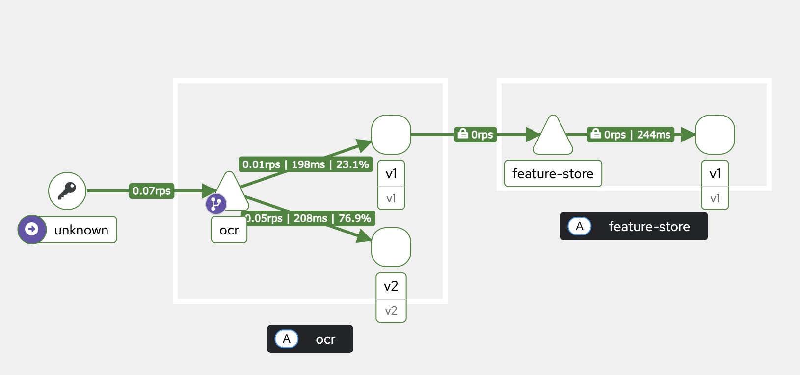
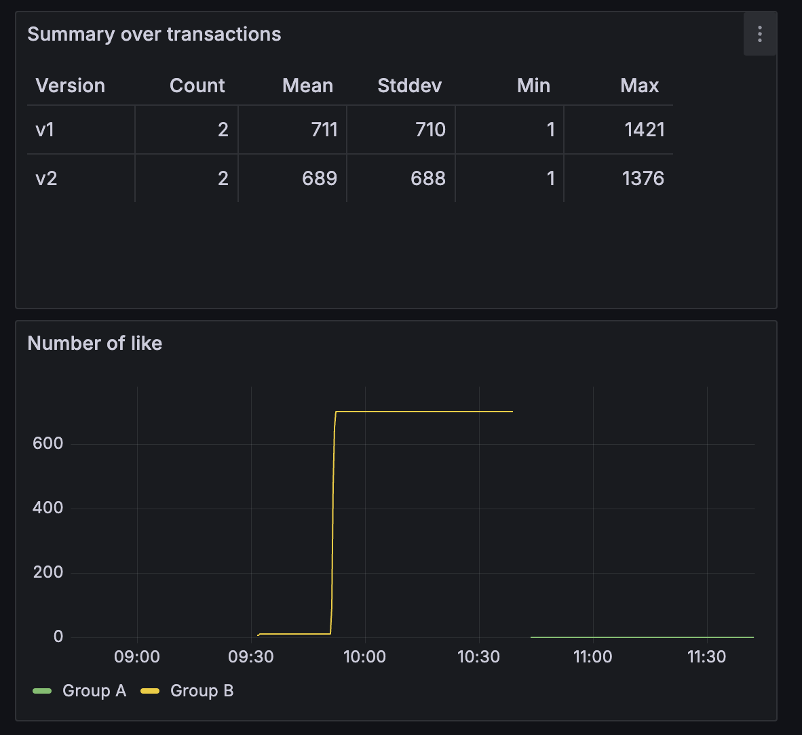

# Istio Installation

## 0. Prerequisites

You need to install 2 things:

- kind (To create a local Kubernetes cluster)
- helm (To install the common chart)

## 1. Install Istio and related tools

### 1.1. Configure the Helm repository

```bash
helm repo add istio https://istio-release.storage.googleapis.com/charts
helm repo update
```

To check the existing repo

```bash
helm search repo istio
```

### 1.2. Install Istio-ingress

```bash
helm install istio-base istio/base -n istio-system --set defaultRevision=default --create-namespace
helm install istiod istio/istiod -n istio-system --wait
helm install istio-ingress istio/gateway -n istio-system
```

Then, you need to inject istio to all services in namespace default.

```bash
kubectl label namespace default istio-injection=enabled --overwrite
```

### 1.3. Install Kiali

```bash
kubectl apply -f https://raw.githubusercontent.com/istio/istio/release-1.27/samples/addons/kiali.yaml
```

or

```bash
helm repo add kiali https://kiali.org/helm-charts
helm repo update
helm install --namespace istio-system  --set auth.strategy="anonymous" kiali-server kiali/kiali-server
```

Then open Kiali

```bash
kubectl port-forward svc/kiali 20001:20001 -n istio-system
```

and go to localhost:20001

### 1.4. Install prometheus and Grafana

```bash
kubectl apply -f https://raw.githubusercontent.com/istio/istio/release-1.27/samples/addons/prometheus.yaml
kubectl apply -f https://raw.githubusercontent.com/istio/istio/release-1.27/samples/addons/grafana.yaml
```

Then open grafana

```bash
kubectl port-forward svc/grafana -n istio-system 3000:3000
```

and go to localhost:3000

## 2. Install House Price and Feature Store service

### 2.1. Install House Price service

```bash
cd istio/helm/house_price
helm upgrade --install house-price .
```

### 2.2. Install Feature Store service

```bash
cd istio/helm/feature_store
helm upgrade --install feature-store .
```

### 2.3. Rebuild image of House Price and Feature Store

Because helm use built image, if you want to rebuild their image, you run the following command:

```bash
docker build -f house-price .
docker build -f feature-store -f Dockerfile.feature_store .
```

## 3. Install Istio config for House Price service

```bash
kubectl apply -f destination_rule.yaml
kubectl apply -f virutalservice.yaml
kubectl apply -f gateway.yaml
```

Then,

```bash
kubectl port-forward -n istio-system svc/istio-ingress 8080:80
```

## 4. Load test for House Price service

```bash
cd loadtest
locust -f locustfile.py --host=http://localhost:8080
```

Then, load test this service

## 5. Show metrics on Kiali



## 6. Build custom metrics on Grafana

Go to localhost:3000 and create a new dashboard.

Then, you copy `config.json` at folder `grafana_dashboard` to JSON model of dashboard.

It will show like that


